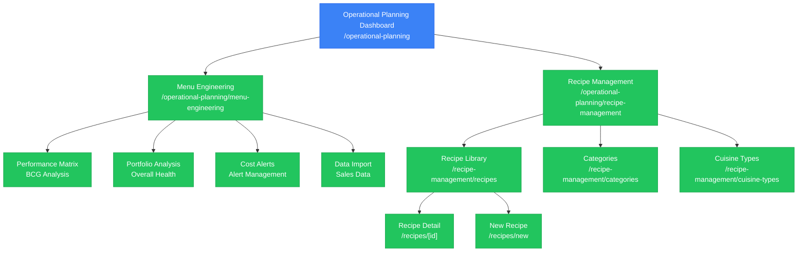

# Operational Planning Module

**Module**: Operational Planning
**Route**: `/operational-planning`
**Status**: ✅ Production (Recipe Management), ✅ Production (Menu Engineering)
**Last Updated**: 2025-10-10

## Table of Contents

- [Overview](#overview)
- [Module Sitemap](#module-sitemap)
- [Submodules](#submodules)
- [Key Features](#key-features)
- [Module Statistics](#module-statistics)
- [Related Documentation](#related-documentation)

## Overview

The Operational Planning module provides comprehensive tools for operational decision-making, menu optimization, and recipe management. It combines demand forecasting, menu engineering analytics, and complete recipe lifecycle management to support data-driven operational decisions.

**Primary Functions**:
- Recipe creation and management
- Menu performance analysis using BCG matrix
- Demand forecasting and visualization
- Inventory planning analytics
- Cost and margin tracking
- CO₂ footprint calculation
- Cuisine and category management

## Module Sitemap



## Submodules

### 1. Menu Engineering
**Route**: `/operational-planning/menu-engineering`
**Status**: ✅ Production
**Purpose**: Analyze menu performance using popularity vs profitability matrix (BCG Matrix for food)
**Documentation**: [MENU-ENGINEERING.md](MENU-ENGINEERING.md)

**Key Pages**:
- Performance Matrix Tab - BCG matrix visualization
- Portfolio Analysis Tab - Overall menu health metrics
- Recipe Details Tab - Individual recipe performance
- Cost Alerts Tab - Cost variance alerts
- Data Import Tab - Sales data import functionality

**Features**:
- **BCG Matrix Analysis**:
  - Stars: High popularity, high profitability
  - Plow Horses: High popularity, low profitability
  - Puzzles: Low popularity, high profitability
  - Dogs: Low popularity, low profitability
- Performance metrics and KPIs
- Sales data import and processing
- Cost alert management
- Recipe performance tracking
- Portfolio health scoring
- Advanced filtering (date range, category, location)

### 2. Recipe Management
**Route**: `/operational-planning/recipe-management`
**Status**: ✅ Production
**Purpose**: Complete recipe lifecycle management with categorization and costing
**Documentation**: [RECIPE-MANAGEMENT.md](RECIPE-MANAGEMENT.md)

**Key Pages**:
- Recipe Library (/recipes) - Grid and list views
- Recipe Detail (/recipes/[id]) - Full recipe information
- New Recipe (/recipes/new) - Recipe creation form
- Categories (/categories) - Hierarchical category management
- Cuisine Types (/cuisine-types) - Regional cuisine classification

**Features**:
- **Recipe Management**:
  - CRUD operations for recipes
  - Grid and list view toggles
  - Recipe status workflow (draft, published)
  - Search and advanced filtering
  - Bulk operations
- **Costing & Analytics**:
  - Cost per portion calculation
  - Selling price management
  - Margin percentage tracking
  - CO₂ equivalent per portion
- **Organization**:
  - 3-level category hierarchy
  - Cuisine type classification
  - Recipe tagging and categorization
- **Sustainability**:
  - Carbon footprint tracking
  - Environmental impact metrics

### 3. Demand Forecasting (Planned)
**Route**: `/operational-planning/demand-forecasting`
**Status**: 🚧 Prototype/Planned
**Purpose**: Predictive analytics for demand planning

**Planned Features**:
- Historical demand analysis
- Trend forecasting
- Seasonal pattern recognition
- Event-based demand prediction

### 4. Inventory Planning (Planned)
**Route**: `/operational-planning/inventory-planning`
**Status**: 🚧 Prototype/Planned
**Purpose**: Inventory optimization and planning

**Planned Features**:
- Stock level optimization
- Overstocked/understocked alerts
- Stockout risk analysis
- Optimal stock levels

## Key Features

### Dashboard Features
- ✅ Draggable widget system (React Beautiful DnD)
- ✅ Demand forecast vs actual charts
- ✅ Menu performance visualization
- ✅ Inventory planning status
- ✅ Recipe updates tracking
- ✅ Upcoming events management
- ✅ Customizable dashboard layout

### Menu Engineering Features
- ✅ BCG Matrix visualization
- ✅ Performance quadrant analysis
- ✅ Sales data import
- ✅ Cost alert system
- ✅ Portfolio health metrics
- ✅ Recipe performance tracking
- ✅ Profitability analysis
- ✅ Popularity metrics
- ✅ Advanced filtering and search

### Recipe Management Features
- ✅ Complete recipe CRUD
- ✅ Multi-view layouts (grid/list)
- ✅ Recipe status management
- ✅ Cost and margin tracking
- ✅ CO₂ footprint calculation
- ✅ Category hierarchy (3 levels)
- ✅ Cuisine type classification
- ✅ Search and filtering
- ✅ Bulk operations
- ✅ Recipe versioning

## Module Statistics

### Code Metrics
- **Main Dashboard**: `page.tsx` (153 lines)
- **Menu Engineering**: `page.tsx` + 3 components (~1,500 lines total)
- **Recipe Management**:
  - Recipe Library: `page.tsx` (~800 lines)
  - Categories: `page.tsx` (~600 lines)
  - Cuisine Types: `page.tsx` (~500 lines)
  - Components: 15+ recipe components

### Data Statistics
- **Mock Recipes**: 8 sample recipes with full data
- **Categories**: 3 main categories with subcategories
- **Cuisine Types**: 10 regional cuisines
- **Menu Items**: 4 items in BCG matrix analysis

### Feature Coverage
- **Menu Engineering**: 100% (all planned features implemented)
- **Recipe Management**: 95% (core features complete, advanced features planned)
- **Demand Forecasting**: 10% (dashboard widget only)
- **Inventory Planning**: 10% (dashboard widget only)

## Technical Architecture

### Technology Stack
- **Framework**: Next.js 14 with App Router
- **Language**: TypeScript
- **UI Library**: React 18
- **Styling**: Tailwind CSS
- **Components**: Shadcn/ui + Radix UI
- **Charts**: Recharts (Bar, Line, Pie)
- **Drag & Drop**: React Beautiful DnD
- **Forms**: React Hook Form + Zod
- **State**: React useState/useReducer

### Key Design Patterns
- **Dashboard**: Widget-based architecture with drag-and-drop
- **Menu Engineering**: Tab-based interface with data visualization
- **Recipe Management**: Master-detail pattern with multi-view support
- **Data Flow**: Component state with prop drilling (no global state)

### Integration Points
- **Product Management**: Recipe ingredient linking
- **Inventory Management**: Stock level integration
- **Vendor Management**: Ingredient supplier tracking
- **Finance**: Cost and pricing integration

## Navigation Structure

```
/operational-planning
├── /                              # Dashboard
├── /menu-engineering              # Menu Engineering
│   └── Tabs:
│       ├── Performance Matrix
│       ├── Portfolio Analysis
│       ├── Recipe Details
│       ├── Cost Alerts
│       └── Data Import
└── /recipe-management
    ├── /recipes                   # Recipe Library
    │   ├── /[id]                  # Recipe Detail
    │   └── /new                   # New Recipe
    ├── /categories                # Categories
    └── /cuisine-types             # Cuisine Types
```

## Related Documentation

- [Menu Engineering Details](./MENU-ENGINEERING.md)
- [Recipe Management Details](./RECIPE-MANAGEMENT.md)
- [Product Management Module](../pm/)
- [Inventory Management Module](../inv/)
- [Vendor Management Module](../vm/)

## Future Enhancements

### Short Term (Q1 2026)
1. Recipe versioning system
2. Allergen management
3. Nutritional analysis
4. Recipe scaling calculator

### Medium Term (Q2-Q3 2026)
1. Demand forecasting implementation
2. Inventory planning optimization
3. Seasonal menu planning
4. Recipe costing engine with live updates

### Long Term (Q4 2026+)
1. AI-powered menu recommendations
2. Predictive analytics for demand
3. Automated menu optimization
4. Integration with POS systems

## Change Log

### Version 1.0 (October 2025)
- Initial production release
- Menu Engineering complete
- Recipe Management complete
- Dashboard with 6 widgets

### Planned Updates
- Version 1.1: Recipe versioning
- Version 1.2: Demand forecasting
- Version 2.0: Complete inventory integration

---

**Module Owner**: Operations Team
**Technical Lead**: Development Team
**Documentation**: Complete
**Last Review**: October 10, 2025
