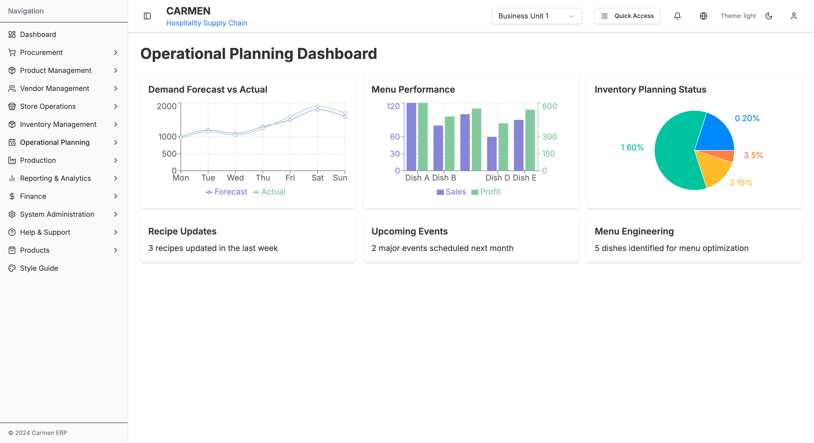
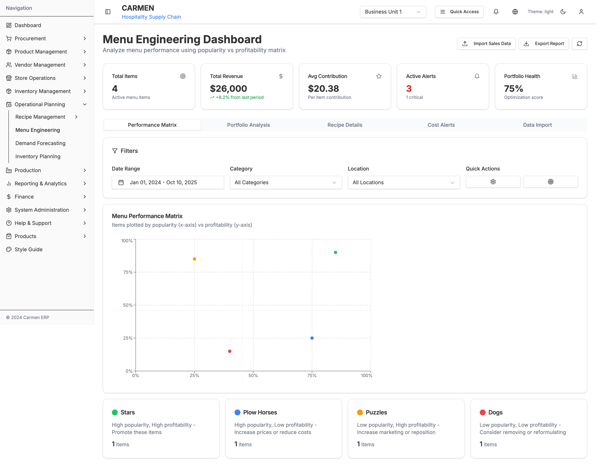
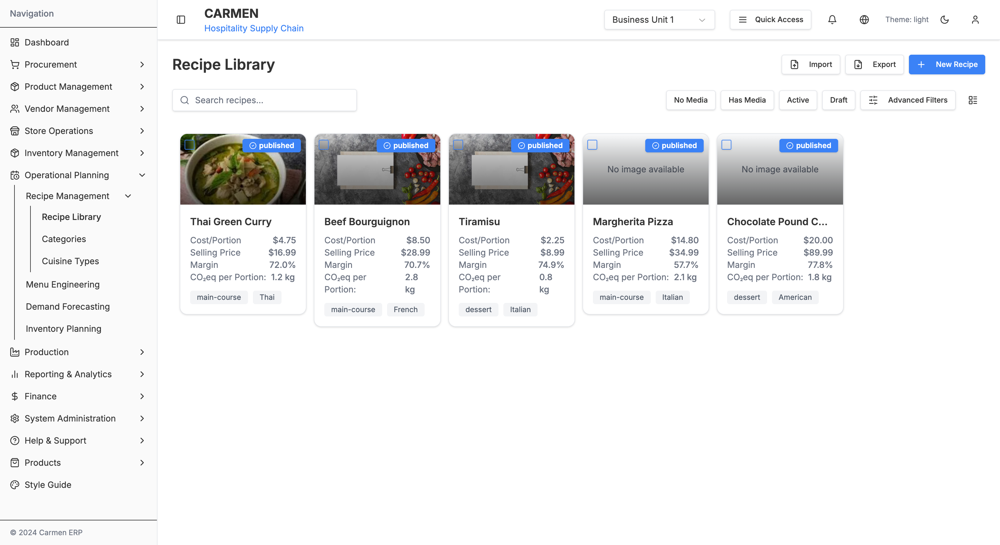
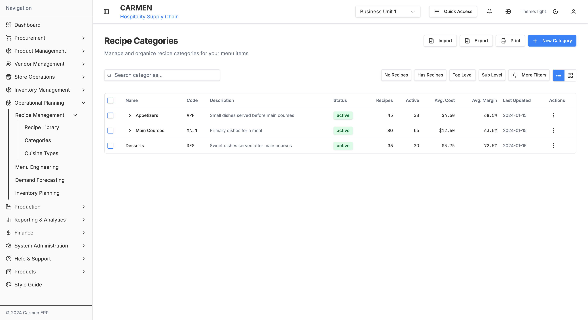
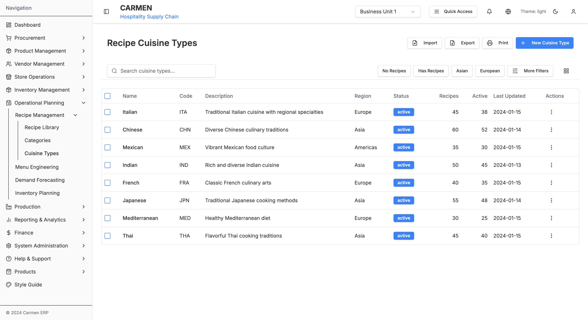

# Operational Planning Module Documentation

## Overview

The Operational Planning module is a comprehensive system for managing recipes, menu engineering, demand forecasting, and inventory planning within the Carmen ERP system. It serves as the central hub for operational decision-making and strategic planning.

### Module Screenshots


*Operational Planning Dashboard - Draggable widget system with demand forecasting and menu performance analytics*

## Module Information

- **Main Path**: `/operational-planning`
- **Icon**: Calendar/Planning
- **Primary Purpose**: Operational planning, recipe management, menu optimization, and demand forecasting
- **Status**: Production-ready with prototype features

## Quick Navigation

- [Submodules](#submodules)
- [Key Features](#key-features)
- [Technical Implementation](#technical-implementation)
- [Screenshots](#screenshots)
- [Navigation Paths](#navigation-paths)

## Submodules

The Operational Planning module consists of 2 main submodules:

### 1. Menu Engineering
**Path**: `/operational-planning/menu-engineering`

**Purpose**: Analyze menu performance using popularity vs profitability matrix


*Menu Engineering Dashboard - Performance matrix with Stars, Plow Horses, Puzzles, and Dogs quadrants*

**Features**:
- Menu performance matrix (BCG matrix for food)
- Sales data import
- Recipe performance metrics
- Cost alert management
- Portfolio analysis
- Data visualization with charts

### 2. Recipe Management
**Path**: `/operational-planning/recipe-management`

**Purpose**: Comprehensive recipe CRUD operations, categorization, and cuisine management


*Recipe Library - Grid view with recipe cards showing cost, margin, and CO₂ metrics*


*Recipe Categories - Hierarchical category management with expandable tree structure*


*Cuisine Types Management - Regional cuisine classification and organization*

**Features**:
- Recipe library with list/grid views
- Recipe categories hierarchy
- Cuisine types management
- Cost and margin tracking
- CO₂ footprint calculation
- Recipe status management (draft, published)

## Key Features

### Operational Planning Dashboard
- ✅ Draggable widget system using React Beautiful DnD
- ✅ Demand forecast vs actual visualization
- ✅ Menu performance charts
- ✅ Inventory planning status (pie chart)
- ✅ Recipe updates tracking
- ✅ Upcoming events management
- ✅ Menu engineering insights

### Menu Engineering
- ✅ BCG Matrix for menu items (Stars, Plow Horses, Puzzles, Dogs)
- ✅ Performance plotting by popularity and profitability
- ✅ Sales data import functionality
- ✅ Cost alert management
- ✅ Portfolio health scoring
- ✅ Recipe performance metrics
- ✅ Advanced filtering (date range, category, location)

### Recipe Management
- ✅ Recipe CRUD operations
- ✅ Grid and list view toggles
- ✅ Recipe categorization (3-level hierarchy)
- ✅ Cuisine type classification
- ✅ Cost per portion calculation
- ✅ Selling price and margin tracking
- ✅ CO₂ equivalent per portion
- ✅ Recipe status workflow (draft, published)
- ✅ Search and filtering
- ✅ Bulk operations

## Technical Implementation

### Tech Stack
- **Frontend**: Next.js 14 (App Router), React, TypeScript
- **UI Components**: Shadcn/ui, Radix UI
- **Styling**: Tailwind CSS
- **Charts**: Recharts (Bar, Line, Pie charts)
- **Drag & Drop**: React Beautiful DnD
- **State Management**: React hooks, useState
- **Forms**: React Hook Form + Zod validation

### Key Components
- `OperationalPlanningPage` - Main dashboard with draggable widgets
- `MenuEngineeringDashboard` - BCG matrix and performance analysis
- `RecipeList` - Recipe library with grid/list views
- `RecipeCard` - Individual recipe display component
- `CategoryTree` - Hierarchical category management
- `CuisineTypesList` - Cuisine types table management

### File Locations
```
app/(main)/operational-planning/
├── page.tsx                           # Main dashboard
├── menu-engineering/
│   ├── page.tsx                       # Menu engineering dashboard
│   └── components/
│       ├── sales-data-import.tsx
│       ├── recipe-performance-metrics.tsx
│       └── cost-alert-management.tsx
└── recipe-management/
    ├── recipes/
    │   ├── page.tsx                   # Recipe library
    │   ├── [id]/page.tsx              # Recipe detail
    │   ├── new/page.tsx               # Create recipe
    │   └── create/page.tsx            # Alternative create
    ├── categories/
    │   └── page.tsx                   # Category management
    └── cuisine-types/
        └── page.tsx                   # Cuisine types
```

## Navigation Paths

- **Dashboard**: `/operational-planning`
- **Menu Engineering**: `/operational-planning/menu-engineering`
- **Recipe Library**: `/operational-planning/recipe-management/recipes`
- **Recipe Categories**: `/operational-planning/recipe-management/categories`
- **Cuisine Types**: `/operational-planning/recipe-management/cuisine-types`

## Screenshots

### Dashboard
- [Operational Planning Dashboard](./screenshots/operational-planning-dashboard.png) - Main dashboard with draggable widgets

### Menu Engineering
- [Menu Engineering Dashboard](./screenshots/menu-engineering-dashboard.png) - Performance matrix and analytics

### Recipe Management
- [Recipe Library](./screenshots/recipe-library.png) - Grid view with recipe cards
- [Recipe Categories](./screenshots/recipe-categories.png) - Hierarchical category tree
- [Cuisine Types](./screenshots/cuisine-types.png) - Cuisine type management table

## Future Enhancements

Potential additions to the Operational Planning module:

1. **Demand Forecasting** - Predictive analytics for demand planning
2. **Inventory Planning** - Automated inventory optimization
3. **Seasonal Menu Planning** - Calendar-based menu scheduling
4. **Recipe Costing Engine** - Real-time cost updates based on ingredient prices
5. **Nutritional Analysis** - Complete nutritional breakdown per recipe
6. **Allergen Management** - Allergen tracking and labeling
7. **Recipe Scaling** - Automatic ingredient scaling for batch sizes
8. **Print Functions** - Recipe cards and menu printing

## Related Documentation

- [Product Management Documentation](../pm/)
- [Inventory Management Documentation](../inv/)
- [Vendor Management Documentation](../vm/)
- [Store Operations Documentation](../store-ops/)

## Contact & Support

For questions or issues related to the Operational Planning module:
- Check the screenshots for visual references
- Review the [OPERATIONAL-PLANNING-MODULE.md](OPERATIONAL-PLANNING-MODULE.md) for detailed specifications
- Contact the development team for technical support

---

**Last Updated**: October 10, 2025
**Module Version**: 1.0 (Menu Engineering), 1.0 (Recipe Management)
**Documentation Status**: Complete
