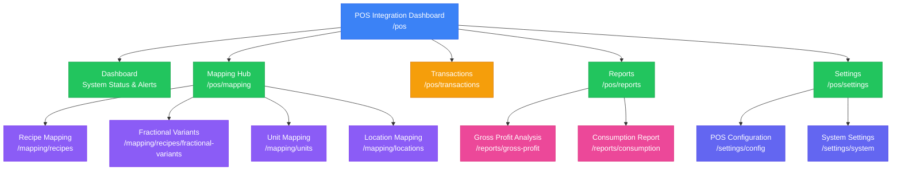
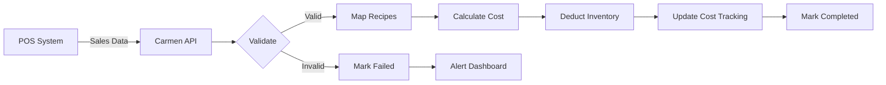

# POS Integration Module

**Module**: POS Integration
**Route**: `/system-administration/system-integrations/pos`
**Status**: ✅ Production
**Parent Module**: System Administration → System Integrations
**Last Updated**: 2025-10-10

## Table of Contents

- [Overview](#overview)
- [Module Sitemap](#module-sitemap)
- [Submodules](#submodules)
- [Key Features](#key-features)
- [Module Statistics](#module-statistics)
- [Related Documentation](#related-documentation)

## Overview

The POS Integration module bridges point-of-sale systems with Carmen ERP's inventory management system, enabling real-time transaction synchronization, automated inventory adjustments, and comprehensive consumption analysis. It supports multiple POS systems, fractional sales tracking, and advanced reporting capabilities.

**Primary Functions**:
- Real-time POS transaction synchronization
- Bidirectional data mapping (POS ↔ ERP)
- Automated inventory deductions based on sales
- Fractional sales management (pizza slices, cake portions)
- Gross profit and consumption analysis
- Multi-location and multi-POS system support

## Module Sitemap



## Submodules

### 1. Dashboard
**Route**: `/system-administration/system-integrations/pos`
**Status**: ✅ Production
**Purpose**: Central monitoring hub and quick access to all POS integration functions

**Key Components**:
- System connection status indicator
- Real-time alert cards:
  - Unmapped items counter with quick link to mapping
  - Failed transactions counter with review link
  - Pending stock-out approvals counter
  - Unmapped fractional variants alert
- Four main category cards:
  - **Setup**: POS Configuration and System Settings
  - **Mapping**: Recipe, Unit, Location, and Fractional Variants mapping
  - **Operations**: Transactions, Failed Transactions, Stock-out Review
  - **Reporting**: Gross Profit Analysis and Consumption Report
- Recent activity feed showing last 10 activities
- Today's sales progress bar

### 2. Mapping
**Route**: `/system-administration/system-integrations/pos/mapping`
**Status**: ✅ Production
**Purpose**: Comprehensive data mapping between POS and ERP systems
**Documentation**: [MAPPING.md](MAPPING.md)

**Submodules**:

#### 2.1 Recipe Mapping
**Route**: `/system-administration/system-integrations/pos/mapping/recipes`

**Features**:
- POS item to recipe mapping
- Unit conversion tracking
- Status indicators (Mapped, Unmapped, Error)
- Category-based filtering
- Location-based filtering (multi-outlet support)
- Search by POS code or recipe code
- Bulk operations (map, unmap, delete)
- Row-level actions (Edit, Delete, History, Test)

**Data Structure**:
```typescript
interface RecipeMapping {
  id: string
  posItemCode: string
  posDescription: string
  recipeCode: string
  recipeName: string
  posUnit: string
  recipeUnit: string
  conversionRate: number
  category: string
  location?: string
  status: 'mapped' | 'unmapped' | 'error'
  lastUpdated: Date
}
```

#### 2.2 Fractional Variants Mapping
**Route**: `/system-administration/system-integrations/pos/mapping/recipes/fractional-variants`

**Purpose**: Manage partial recipe sales for items like pizzas, cakes, and large batches

**Features**:
- Base recipe selection and configuration
- Variant definition:
  - Slice (typical: 1/8 for pizza, 1/16 for cake)
  - Quarter (1/4)
  - Half (1/2)
  - Whole (1/1)
- Automatic yield percentage calculation
- Individual POS code assignment per variant
- Variant-specific pricing
- Cost calculation per portion size
- Inventory deduction automation
- Visual hierarchy display

**Example Scenarios**:
- **Pizza**: Base recipe produces 1 whole pizza
  - Slice: 1/8 of base recipe, POS code: POS001, Price: $3.99
  - Whole: 1/1 of base recipe, POS code: POS001W, Price: $28.99
- **Chocolate Cake**: Base recipe produces 1 whole cake (16 slices)
  - Slice: 1/16 (6.3%), POS code: POS005, Price: $6.99
  - Quarter: 1/4 (25%), POS code: POS005Q, Price: $24.99
  - Half: 1/2 (50%), POS code: POS005H, Price: $47.99
  - Whole: 1/1 (100%), POS code: POS005W, Price: $89.99

**Business Rules**:
- Each variant must have unique POS code
- Yield percentage cannot exceed 100%
- Cost calculation: Base Recipe Cost × Yield Percentage
- Inventory deduction: Base Recipe Quantity × Yield Percentage
- Minimum variants: Typically Slice + Whole
- Maximum variants: Unlimited (common: Slice, Quarter, Half, Whole)

#### 2.3 Unit Mapping
**Route**: `/system-administration/system-integrations/pos/mapping/units`

**Features**:
- POS unit to ERP unit conversion
- Conversion factor configuration
- Unit type classification (Sales Unit, Recipe Unit, Both)
- Active/Inactive status management
- Search and filtering

**Common Mappings**:
- PCS (Piece) → EA (Each): 1:1
- GLASS → EA (Each): 1:1
- BTL (Bottle) → EA (Each): 1:1
- SLICE → EA (Each): 0.125:1 (for 8-slice pizza)
- OZ (Ounce) → KG (Kilogram): 0.0283:1
- LB (Pound) → KG (Kilogram): 0.4536:1

#### 2.4 Location Mapping
**Route**: `/system-administration/system-integrations/pos/mapping/locations`

**Features**:
- Multi-outlet POS location mapping
- Support for multiple POS systems:
  - Comanche POS
  - HotelTime POS
  - Soraso POS
  - Custom POS systems
- Location status tracking (Active, Unmapped, Error)
- Last sync timestamp per location
- Location-specific configuration override

### 3. Transactions
**Route**: `/system-administration/system-integrations/pos/transactions`
**Status**: ✅ Production
**Purpose**: Comprehensive transaction management and monitoring
**Documentation**: [TRANSACTIONS.md](TRANSACTIONS.md)

**Features**:
- Transaction list with pagination (10/20/50/100 per page)
- Advanced filtering:
  - Date range picker (with presets)
  - Location filter (multi-select)
  - Status filter (Completed, Processing, Failed, Voided)
  - Transaction type filter
  - Full-text search
- Expandable item details per transaction
- Bulk operations:
  - Bulk select (checkbox)
  - Bulk void
  - Bulk export
- Row-level actions:
  - View transaction details
  - Void transaction (if not already voided)
  - Reprocess failed transaction
  - Export individual transaction
- Status indicators with color coding

**Transaction Processing Flow**:


**Status Definitions**:
- **Completed**: Successfully processed, inventory updated
- **Processing**: Currently being processed (transient state)
- **Failed**: Error occurred, requires manual review and reprocessing
- **Voided**: Transaction cancelled, inventory adjustment reversed

### 4. Reports
**Route**: `/system-administration/system-integrations/pos/reports`
**Status**: ✅ Production
**Purpose**: Sales performance and consumption analysis
**Documentation**: [REPORTS.md](REPORTS.md)

#### 4.1 Gross Profit Analysis
**Route**: `/system-administration/system-integrations/pos/reports/gross-profit`

**Features**:
- Key metrics dashboard:
  - Sales Revenue (with trend indicator)
  - Cost of Sales (with vs target)
  - Gross Profit (with vs target)
  - Margin % (with vs target)
- Performance trend chart (6-month view)
  - Bar chart: Sales and Cost
  - Line chart: Margin %
- Detailed analysis table with three views:
  - **By Outlet**: Performance per location
  - **By Category**: Performance per menu category
  - **By Item**: Individual recipe profitability
- Date range filtering
- Export options (PDF, Excel, CSV)
- Refresh and share functionality

**Calculation Formulas**:
- `Gross Profit = Sales Revenue - Cost of Sales`
- `Margin % = (Gross Profit / Sales Revenue) × 100`
- `vs Target = ((Actual - Target) / Target) × 100`

#### 4.2 Consumption Report
**Route**: `/system-administration/system-integrations/pos/reports/consumption`

**Features**:
- Key metrics comparison:
  - Theoretical Usage (based on recipe costs × quantity sold)
  - Actual Usage (based on actual inventory deductions)
  - Variance Amount (Actual - Theoretical)
  - Variance % against target (typically 3%)
- Daily consumption trend chart (10-day view)
  - Dual-line chart: Theoretical vs Actual
- Three analysis tabs:
  - **Overview**: High-level trend analysis
  - **By Category**: Category-level variance
  - **By Item**: Item-level detail with drill-down
- Location filtering
- Date range filtering
- Export functionality

**Business Value**:
- Identify waste and shrinkage
- Monitor portion control compliance
- Validate recipe accuracy
- Detect potential theft
- Track preparation efficiency
- Support cost control initiatives

**Variance Thresholds**:
- **Acceptable**: ≤3% variance (green indicator)
- **Warning**: 3-5% variance (yellow indicator)
- **Critical**: >5% variance (red indicator, requires investigation)

### 5. Settings
**Route**: `/system-administration/system-integrations/pos/settings`
**Status**: ✅ Production
**Purpose**: Configure POS system integration and operational parameters

#### 5.1 POS Configuration
**Route**: `/system-administration/system-integrations/pos/settings/config`

**Configuration Sections**:

**Basic Settings**:
- POS System Type (dropdown: Comanche, HotelTime, Soraso, Custom)
- Integration Name
- Description
- Active/Inactive toggle

**Connection Details**:
- API Endpoint URL
- Authentication Method:
  - API Key
  - Basic Auth (Username/Password)
  - OAuth 2.0
  - Custom
- Connection timeout
- Retry policy

**Sync Settings**:
- Sync Frequency (Real-time, Every 5 min, Every 15 min, Hourly)
- Batch Size (for bulk sync)
- Start Time (for scheduled sync)
- Sync Direction (POS → Carmen, Bidirectional)

**Field Mapping**:
- Configurable field mapping table:
  - Carmen Field (dropdown)
  - POS Field (dropdown)
  - Data Type (Text, Number, Date, Decimal, Boolean)
  - Required (checkbox)
  - Actions (Remove mapping)
- Add Field Mapping button
- Pre-defined templates for common POS systems

**Advanced Options**:
- Request timeout (seconds)
- Enable logging
- Log level (Info, Debug, Error)
- Error notification recipients
- Test Connection button

#### 5.2 System Settings
**Route**: `/system-administration/system-integrations/pos/settings/system`

**Workflow Settings**:
- Require approval for stock-outs
- Auto-void failed transactions after X hours
- Send notifications for unmapped items
- Alert threshold for variance % (default: 5%)

**Notification Preferences**:
- Email notifications enabled
- Notification recipients (multi-select users)
- Notify on: Failed transactions, Unmapped items, High variance, Connection errors

**Default Behaviors**:
- Default location for unmapped items
- Default status for new mappings
- Auto-map similar items (based on name matching)

## Key Features

### Real-Time Synchronization
- ✅ Continuous data sync from POS to Carmen
- ✅ Configurable sync frequency (real-time to hourly)
- ✅ Batch processing for large volumes
- ✅ Automatic retry on failure with exponential backoff
- ✅ Connection monitoring and status alerts

### Comprehensive Mapping System
- ✅ Recipe mapping with unit conversion
- ✅ Fractional variants for partial sales (unique feature)
- ✅ Unit conversion with flexible factors
- ✅ Multi-location mapping
- ✅ Bulk mapping operations
- ✅ Mapping status tracking (Mapped/Unmapped/Error)

### Intelligent Transaction Processing
- ✅ Automatic inventory deduction
- ✅ Cost tracking and calculation
- ✅ Failed transaction detection and alerting
- ✅ Transaction voiding with inventory reversal
- ✅ Stock-out approval workflow
- ✅ Full audit trail

### Advanced Analytics
- ✅ Gross profit analysis with trend visualization
- ✅ Consumption variance reporting
- ✅ Multi-dimensional analysis (outlet, category, item)
- ✅ Target vs actual comparison
- ✅ Variance threshold alerts
- ✅ Export to multiple formats

### Multi-POS Support
- ✅ Support for multiple POS systems simultaneously
- ✅ Comanche POS integration
- ✅ HotelTime POS integration
- ✅ Soraso POS integration
- ✅ Generic REST API support
- ✅ Customizable field mapping per POS system

### Operational Excellence
- ✅ Dashboard with real-time alerts
- ✅ Quick access to critical functions
- ✅ Recent activity feed
- ✅ Status indicators throughout
- ✅ Comprehensive search and filtering
- ✅ Bulk operations support

## Module Statistics

### Code Metrics
- **Main Dashboard**: `page.tsx` (~600 lines)
- **Mapping Components**:
  - Recipe Mapping: `page.tsx` (~225 lines)
  - Fractional Variants: `page.tsx` (~400 lines)
  - Unit Mapping: `page.tsx` (~200 lines)
  - Location Mapping: `page.tsx` (~200 lines)
  - Shared Components: ~500 lines
- **Transactions**: `page.tsx` (~540 lines)
- **Reports**:
  - Gross Profit: `page.tsx` (~235 lines)
  - Consumption: `page.tsx` (~300 lines)
- **Settings**:
  - Configuration: `page.tsx` (~500 lines)
  - System Settings: `page.tsx` (~300 lines)

### Total Lines of Code
- **Estimated Total**: ~4,000 lines
- **Components**: 20+ reusable components
- **Pages**: 11 distinct pages

### Feature Coverage
- **Dashboard**: 100% (complete)
- **Mapping**: 100% (all 4 mapping types implemented)
- **Transactions**: 100% (full CRUD + advanced filtering)
- **Reports**: 100% (both reports fully functional)
- **Settings**: 95% (core features complete, advanced options planned)

## Technical Architecture

### Technology Stack
- **Framework**: Next.js 14 with App Router
- **Language**: TypeScript
- **UI Library**: React 18
- **Styling**: Tailwind CSS
- **Components**: Shadcn/ui + Radix UI
- **Tables**: TanStack Table (React Table v8)
- **Charts**: Recharts (Bar, Line, Area)
- **Forms**: React Hook Form + Zod
- **Date Handling**: date-fns, React Day Picker
- **State**: React useState/useReducer (no global state)

### Key Design Patterns
- **Dashboard**: Card-based interface with alert system
- **Mapping**: Shared data table component with custom renderers
- **Transactions**: List with expandable detail view
- **Reports**: Dashboard layout with multi-view tabs
- **Settings**: Form-based configuration with validation

### Data Flow Architecture
```
POS System → API Gateway → Validation → Mapping Engine → Cost Calculation → Inventory Service → Database
                ↓
          Error Handling
                ↓
          Alert Dashboard
```

### Integration Points
- **Recipe Management**: Linked to Operational Planning recipes
- **Inventory Management**: Real-time stock deductions
- **Product Management**: Ingredient and product data
- **Reporting Module**: Consumption and profitability data
- **Notification System**: Alerts and workflow notifications

## Navigation Structure

```
/system-administration/system-integrations/pos/
├── /                              # Dashboard
├── /mapping/
│   ├── /recipes                   # Recipe Mapping
│   │   └── /fractional-variants   # Fractional Variants
│   ├── /units                     # Unit Mapping
│   └── /locations                 # Location Mapping
├── /transactions                  # Transaction Management
├── /reports/
│   ├── /gross-profit              # Gross Profit Analysis
│   └── /consumption               # Consumption Report
└── /settings/
    ├── /config                    # POS Configuration
    └── /system                    # System Settings
```

## Related Documentation

- [Mapping Subsystem Details](./MAPPING.md)
- [Transaction Management](./TRANSACTIONS.md)
- [Reporting System](./REPORTS.md)
- [Operational Planning Module](../operational-planning/)
- [Inventory Management Module](../inventory/)
- [System Administration Module](../system-administration/)

## Future Enhancements

### Short Term (Q1 2026)
1. Real-time WebSocket updates on dashboard
2. Advanced variance alert rules with customizable thresholds
3. Recipe cost optimization suggestions based on consumption data
4. Mobile-responsive views for all pages
5. Enhanced export formats (scheduled reports via email)

### Medium Term (Q2-Q3 2026)
1. AI-powered anomaly detection for consumption patterns
2. Predictive consumption forecasting
3. Multi-currency support for international locations
4. Advanced reconciliation tools with automatic adjustments
5. Batch transaction processing with progress tracking
6. Integration with third-party delivery platforms (Uber Eats, DoorDash)

### Long Term (Q4 2026+)
1. Machine learning for fraud detection
2. Automated recipe correction suggestions based on variance trends
3. Cross-location comparison analytics with benchmarking
4. Customer behavior analytics from POS data
5. Dynamic pricing recommendations based on demand and cost
6. Voice-activated queries and reporting
7. Blockchain-based transaction verification

## Change Log

### Version 1.0 (October 2025)
- Initial production release
- Full mapping system (recipes, units, locations, fractional variants)
- Transaction management with advanced filtering
- Gross profit and consumption reports
- POS configuration and system settings
- Dashboard with real-time alerts

### Planned Updates
- Version 1.1: Real-time dashboard updates (WebSocket)
- Version 1.2: AI-powered anomaly detection
- Version 2.0: Multi-POS system concurrent support

---

**Module Owner**: System Administration Team
**Technical Lead**: Development Team
**Business Owner**: Operations & Finance Teams
**Documentation**: Complete
**Last Review**: October 10, 2025
