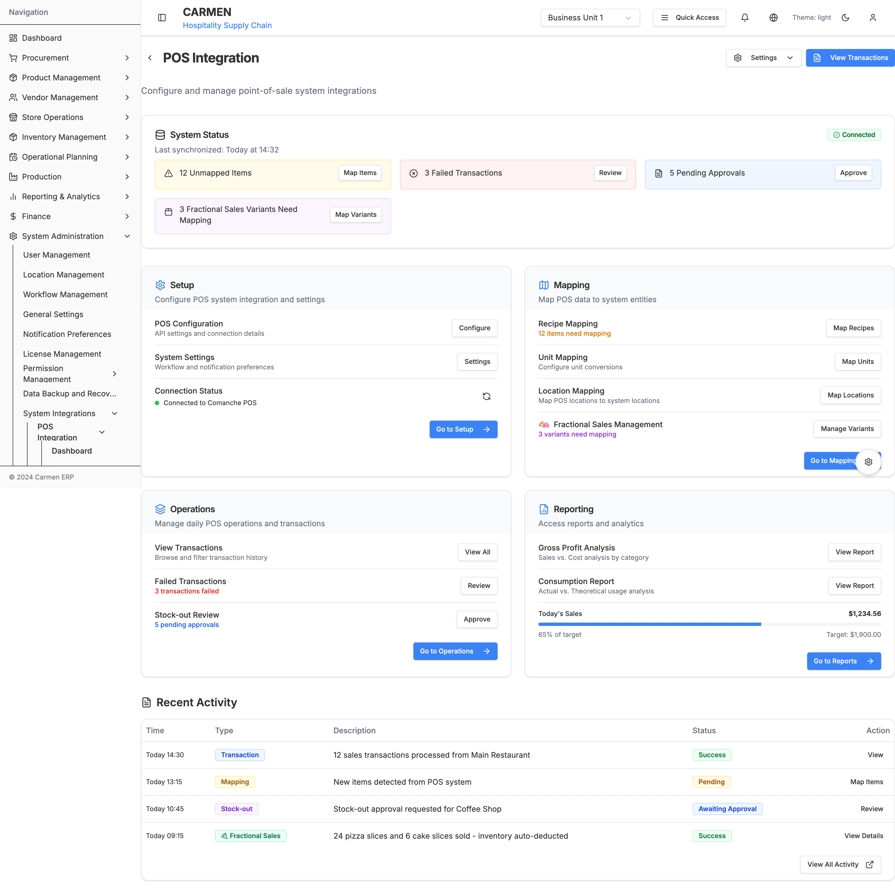
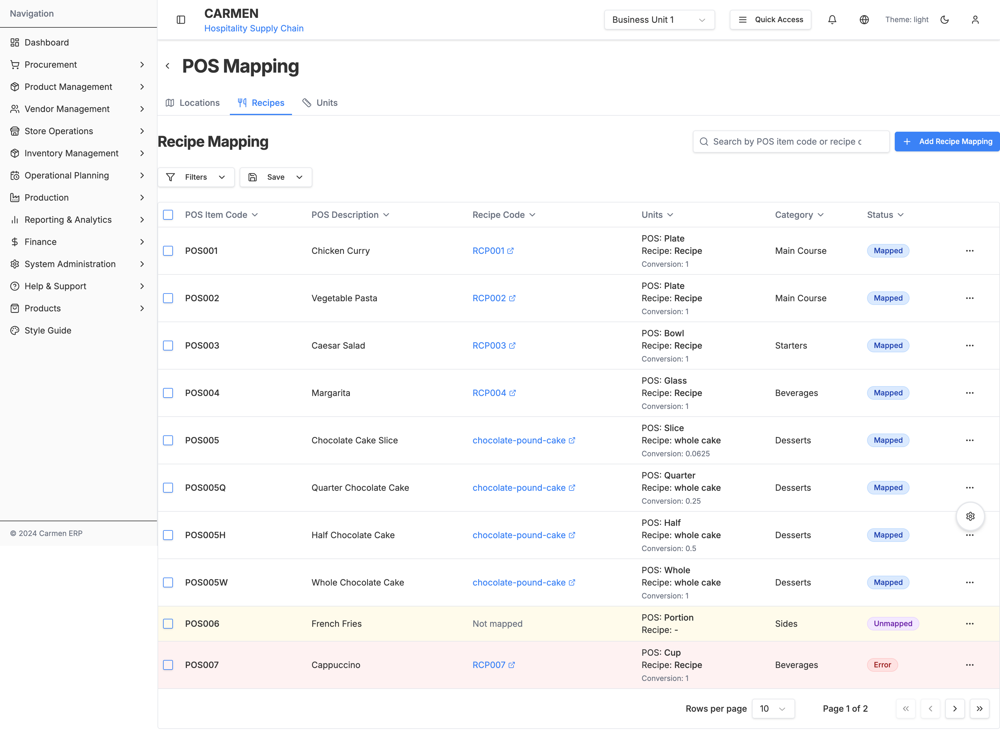
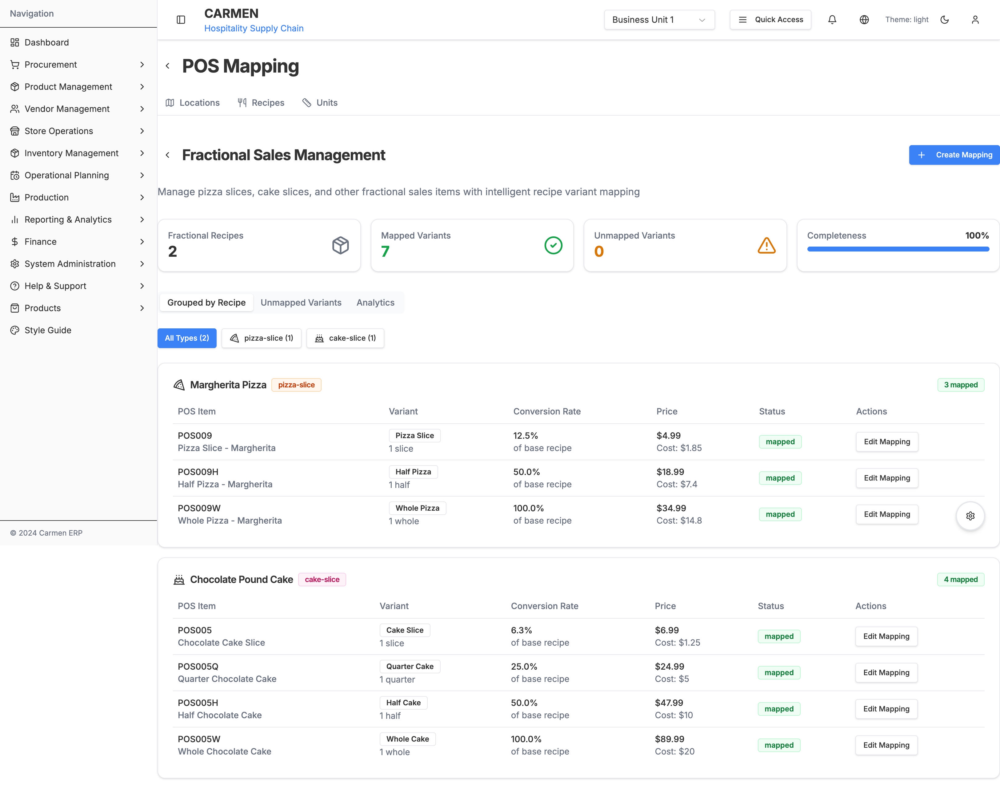
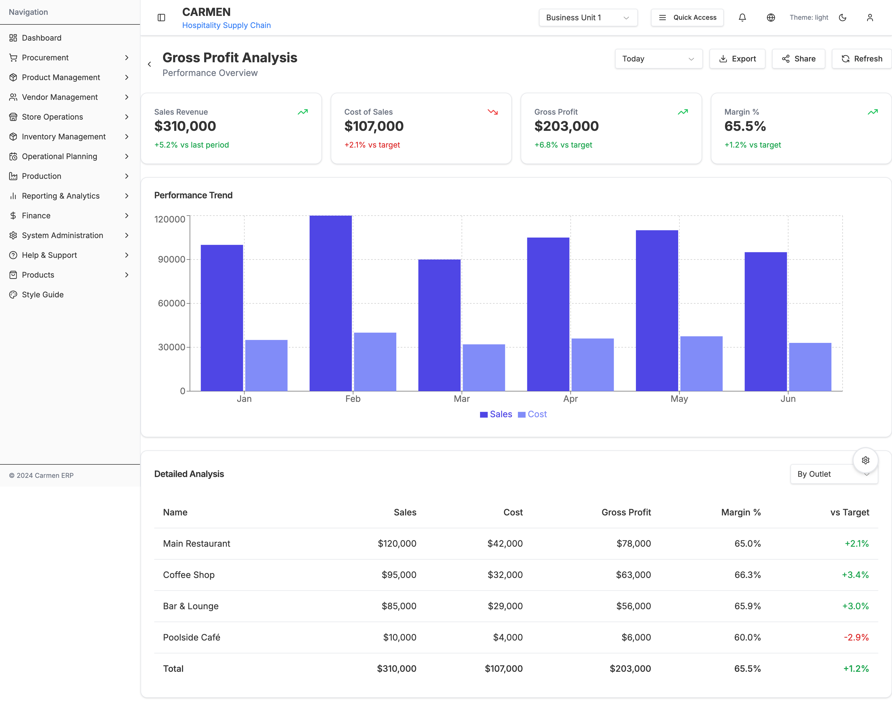
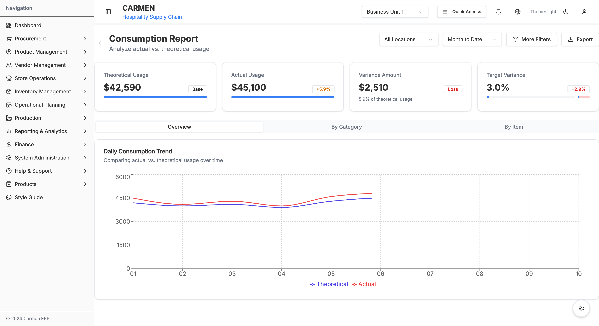
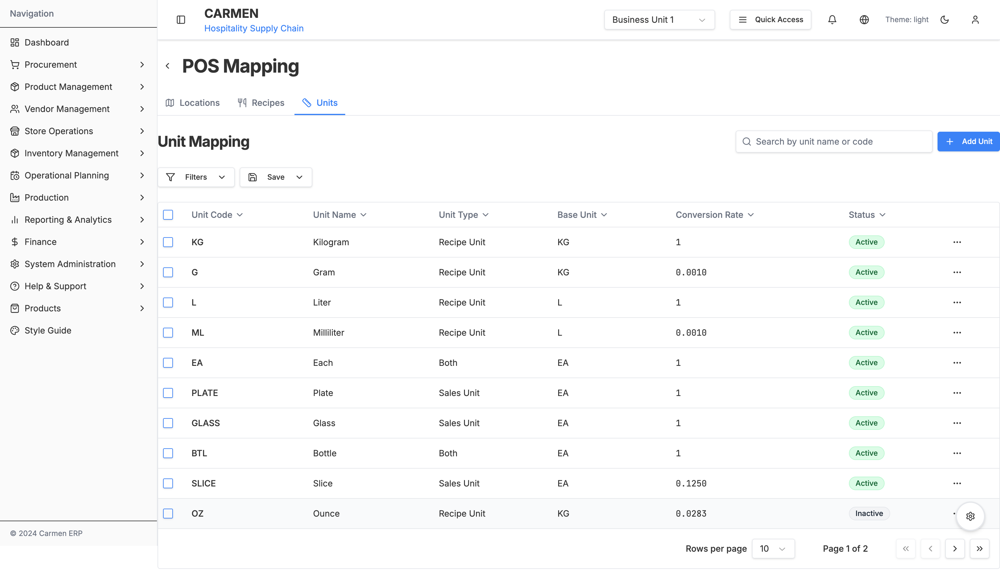
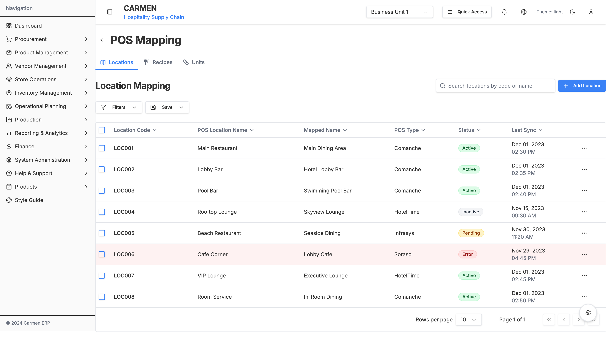
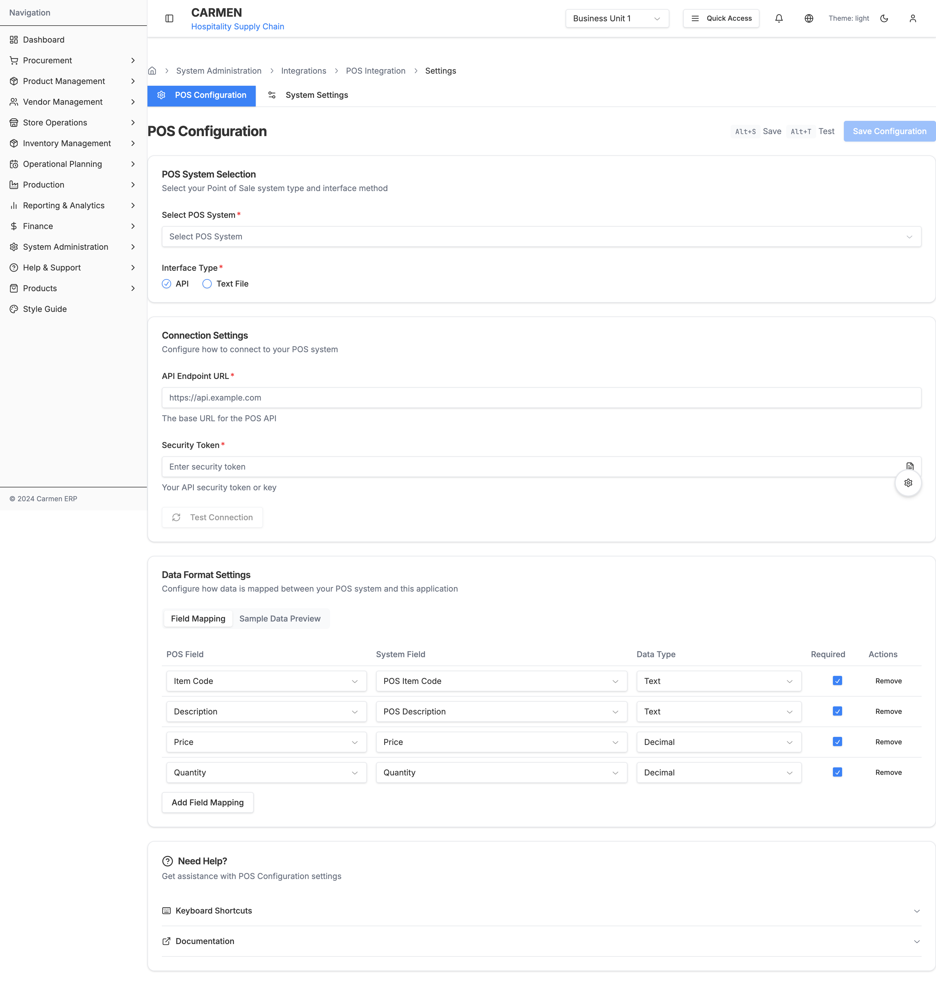

# POS Integration Module Documentation

## Overview

The POS Integration module provides comprehensive tools for integrating point-of-sale systems with the Carmen ERP inventory management system. It enables seamless synchronization of sales transactions, automated inventory deductions, recipe mapping, and detailed consumption analysis.

**Primary Functions**:
- Real-time POS transaction synchronization
- Recipe and item mapping between POS and ERP systems
- Unit conversion management
- Location mapping and multi-outlet support
- Fractional sales management (pizza slices, cake portions)
- Gross profit and consumption analysis
- Automated inventory adjustments from sales data

## Screenshots


*POS Integration Dashboard - System status overview with alerts and quick access to all functions*


*Recipe Mapping - Map POS items to system recipes with unit conversion tracking*


*Fractional Variants Management - Configure pizza slices, cake portions, and multi-yield recipes*


*Transaction Management - Browse, filter, and manage POS sales transactions*


*Gross Profit Analysis - Sales vs cost analysis with trend visualization*


*Consumption Report - Actual vs theoretical usage analysis*

## Module Information

- **Main Path**: `/system-administration/system-integrations/pos`
- **Icon**: Database/Cable
- **Primary Purpose**: POS system integration, sales data synchronization, and consumption analysis
- **Status**: Production-ready
- **Parent Module**: System Administration → System Integrations

## Quick Navigation

- [Module Structure](#module-structure)
- [Key Features](#key-features)
- [Technical Implementation](#technical-implementation)
- [Navigation Paths](#navigation-paths)

## Module Structure

The POS Integration module consists of 5 main sections:

### 1. Dashboard
**Path**: `/system-administration/system-integrations/pos`

**Purpose**: Central hub for POS integration monitoring and quick access


**Features**:
- System connection status (Connected/Disconnected)
- Last sync timestamp
- Alert cards for:
  - Unmapped items requiring recipe mapping
  - Failed transactions requiring review
  - Pending stock-out approvals
  - Unmapped fractional variants
- Quick access cards for:
  - Setup (Configuration & System Settings)
  - Mapping (Recipes, Units, Locations, Fractional Variants)
  - Operations (Transactions, Failed Transactions, Stock-out Review)
  - Reporting (Gross Profit Analysis, Consumption Report)
- Recent activity feed with transaction history

### 2. Mapping
**Path**: `/system-administration/system-integrations/pos/mapping`

**Purpose**: Map POS data to ERP system entities


*Recipe Mapping - Primary interface for mapping POS items to system recipes*


*Unit Mapping - Configure unit conversions between POS and ERP*


*Location Mapping - Map POS outlets to system locations*


*Fractional Variants - Manage pizza slices, cake portions, and multi-yield recipes*

**Submodules**:

#### 2.1 Recipe Mapping
**Path**: `/system-administration/system-integrations/pos/mapping/recipes`

**Features**:
- Map POS items to system recipes
- Track mapping status (Mapped, Unmapped, Error)
- Unit conversion configuration
- Category-based organization
- Bulk mapping operations
- Search and advanced filtering
- Status badges for quick identification

**Data Displayed**:
- POS Item Code
- POS Description
- Recipe Code (with link to recipe detail)
- Unit conversion (POS Unit → Recipe Unit)
- Conversion rate
- Category
- Status (Mapped/Unmapped/Error)
- Actions menu

#### 2.2 Fractional Variants Mapping
**Path**: `/system-administration/system-integrations/pos/mapping/recipes/fractional-variants`

**Purpose**: Manage partial recipe sales (pizza slices, cake portions)

**Features**:
- Configure fractional sales for base recipes
- Define portion sizes (slice, quarter, half, whole)
- Automatic yield percentage calculation
- Individual pricing per variant
- Cost calculation per portion
- Inventory deduction automation
- Visual recipe hierarchy

**Example Use Cases**:
- Pizza: Sold by slice (1/8) or whole
- Cake: Sold by slice (1/16), quarter (1/4), half (1/2), or whole
- Large batches: Multiple portion sizes from single recipe

**Data Displayed**:
- POS Code and Description
- Variant Type (Slice, Quarter, Half, Whole)
- Portion Size
- Yield Percentage (% of base recipe)
- Selling Price and Cost
- Mapping Status
- Edit Mapping action

#### 2.3 Unit Mapping
**Path**: `/system-administration/system-integrations/pos/mapping/units`

**Features**:
- Map POS units to system units
- Configure conversion factors
- Support for sales units and recipe units
- Active/Inactive status management
- Bulk operations

**Example Mappings**:
- PCS (Piece) → EA (Each): 1:1
- GLASS → EA (Each): 1:1
- SLICE → EA (Each): 0.125:1 (for fractional items)
- OZ (Ounce) → KG (Kilogram): 0.0283:1

#### 2.4 Location Mapping
**Path**: `/system-administration/system-integrations/pos/mapping/locations`

**Features**:
- Map POS locations to system locations
- Support multiple POS systems (Comanche, HotelTime, Soraso)
- Track mapping status
- Sync timestamp tracking
- Location-specific settings

**Data Displayed**:
- POS Location Code
- POS Location Name
- ERP Location (mapped)
- POS System
- Status (Active/Unmapped/Error)
- Last Sync Date/Time
- Actions menu

### 3. Transactions
**Path**: `/system-administration/system-integrations/pos/transactions`

**Purpose**: Browse, filter, and manage POS sales transactions


**Features**:
- Transaction list with pagination
- Date range filtering
- Location filtering
- Status filtering (Completed, Processing, Failed, Voided)
- Transaction type filtering
- Expandable item details
- Bulk selection and export
- Action menu per transaction (View, Void, Reprocess, Export)

**Transaction Workflow**:
1. POS system sends sales data
2. Carmen receives and validates transaction
3. Recipe mapping applied
4. Inventory automatically deducted
5. Cost tracking updated
6. Transaction marked as Completed

**Status Types**:
- **Completed**: Successfully processed and inventory updated
- **Processing**: Currently being processed
- **Failed**: Error occurred, requires review
- **Voided**: Transaction cancelled

**Data Displayed per Transaction**:
- Date and Time
- Location (Name and Code)
- Item Details (with expand for full list)
- Total Amount
- Status Badge
- Actions Menu

### 4. Reports
**Path**: `/system-administration/system-integrations/pos/reports`

**Purpose**: Analyze sales performance and consumption patterns

#### 4.1 Gross Profit Analysis
**Path**: `/system-administration/system-integrations/pos/reports/gross-profit`


**Features**:
- Sales revenue tracking
- Cost of sales calculation
- Gross profit computation
- Margin percentage analysis
- Trend visualization (6-month)
- Multi-outlet comparison
- Export to Excel/PDF
- Date range filtering
- View by: Outlet, Category, or Item

**Key Metrics**:
- **Sales Revenue**: Total sales for period
- **Cost of Sales**: Total ingredient/recipe costs
- **Gross Profit**: Revenue minus cost
- **Margin %**: (Gross Profit / Revenue) × 100
- **vs Target**: Comparison to target margins

**Analysis Views**:
- By Outlet: Performance per location
- By Category: Performance per menu category
- By Item: Individual recipe profitability

#### 4.2 Consumption Report
**Path**: `/system-administration/system-integrations/pos/reports/consumption`


**Features**:
- Theoretical usage calculation (based on recipe costs × sales quantity)
- Actual usage tracking (based on inventory deductions)
- Variance analysis (Actual - Theoretical)
- Daily consumption trends
- Location-based filtering
- Category-based analysis
- Item-level detail view
- Variance alerts and thresholds

**Key Metrics**:
- **Theoretical Usage**: Expected consumption based on recipes
- **Actual Usage**: Real inventory deductions
- **Variance Amount**: Difference (Actual - Theoretical)
- **Variance %**: (Variance / Theoretical) × 100
- **Target Variance**: Acceptable variance threshold (typically 3%)

**Use Cases**:
- Identify waste or theft
- Monitor portion control
- Validate recipe accuracy
- Track preparation efficiency
- Detect inventory shrinkage

### 5. Settings
**Path**: `/system-administration/system-integrations/pos/settings`

**Purpose**: Configure POS system integration parameters

#### 5.1 POS Configuration
**Path**: `/system-administration/system-integrations/pos/settings/config`



**Features**:
- POS system selection (Comanche, HotelTime, Soraso, etc.)
- API endpoint configuration
- Authentication settings (API Key, Username/Password, OAuth)
- Connection testing
- Field mapping configuration
- Sync frequency settings
- Data retention policies

**Configuration Sections**:
- **Basic Settings**: POS system type, name, description
- **Connection Details**: API URL, authentication method
- **Sync Settings**: Frequency, batch size, retry policy
- **Field Mapping**: Map POS fields to Carmen fields
- **Advanced Options**: Timeout, logging, error handling

#### 5.2 System Settings
**Path**: `/system-administration/system-integrations/pos/settings/system`

**Features**:
- Workflow preferences
- Notification settings
- Default behaviors
- Approval requirements
- Stock-out handling
- Failed transaction policies

## Key Features

### Real-Time Synchronization
- ✅ Continuous POS data sync
- ✅ Automatic inventory adjustments
- ✅ Real-time status monitoring
- ✅ Error detection and alerting

### Comprehensive Mapping
- ✅ Recipe-to-POS item mapping with unit conversion
- ✅ Fractional sales management (pizza slices, cake portions)
- ✅ Multi-location support
- ✅ Flexible unit conversion system
- ✅ Status tracking (Mapped/Unmapped/Error)

### Transaction Management
- ✅ Transaction history with full audit trail
- ✅ Advanced filtering and search
- ✅ Bulk operations and export
- ✅ Failed transaction recovery
- ✅ Stock-out approval workflow

### Advanced Reporting
- ✅ Gross profit analysis with trend visualization
- ✅ Consumption reporting (Actual vs Theoretical)
- ✅ Variance analysis and alerts
- ✅ Multi-dimensional views (by outlet, category, item)
- ✅ Export to Excel/PDF

### Flexible Configuration
- ✅ Support for multiple POS systems
- ✅ Customizable field mapping
- ✅ Configurable sync frequency
- ✅ Authentication flexibility (API Key, OAuth, Basic Auth)
- ✅ Connection testing and validation

## Technical Implementation

### Tech Stack
- **Frontend**: Next.js 14 (App Router), React, TypeScript
- **UI Components**: Shadcn/ui, Radix UI
- **Styling**: Tailwind CSS
- **Charts**: Recharts (Bar, Line, Area charts)
- **Tables**: TanStack Table (React Table v8)
- **Forms**: React Hook Form + Zod validation
- **Date Handling**: date-fns, React Day Picker

### Key Components
- `POSIntegrationPage` - Main dashboard with status cards
- `RecipeMappingPage` - Recipe mapping interface
- `FractionalVariantsMappingPage` - Fractional sales management
- `UnitMappingPage` - Unit conversion configuration
- `LocationMappingPage` - Location mapping interface
- `TransactionsPage` - Transaction list and management
- `GrossProfitDashboard` - Gross profit analysis report
- `ConsumptionReportPage` - Consumption analysis report
- `POSConfigPage` - POS configuration settings

### File Locations
```
app/(main)/system-administration/system-integrations/pos/
├── page.tsx                           # Main dashboard
├── layout.tsx                         # POS layout wrapper
├── components/
│   ├── floating-settings-button.tsx
│   ├── settings-help-section.tsx
│   └── settings-nav.tsx
├── mapping/
│   ├── layout.tsx
│   ├── components/                    # Shared mapping components
│   │   ├── data-table.tsx
│   │   ├── filter-bar.tsx
│   │   ├── mapping-header.tsx
│   │   ├── mapping-nav.tsx
│   │   ├── row-actions.tsx
│   │   └── status-badge.tsx
│   ├── recipes/
│   │   ├── page.tsx                   # Recipe mapping
│   │   ├── data.ts
│   │   ├── types.ts
│   │   ├── fractional-mapping-helper.ts
│   │   └── fractional-variants/
│   │       └── page.tsx               # Fractional variants
│   ├── units/
│   │   ├── page.tsx                   # Unit mapping
│   │   ├── data.ts
│   │   └── types.ts
│   └── locations/
│       ├── page.tsx                   # Location mapping
│       ├── data.ts
│       └── types.ts
├── transactions/
│   └── page.tsx                       # Transaction management
├── reports/
│   ├── page.tsx                       # Reports hub
│   ├── gross-profit/
│   │   └── page.tsx                   # Gross profit analysis
│   └── consumption/
│       └── page.tsx                   # Consumption report
└── settings/
    ├── layout.tsx
    ├── page.tsx                       # Settings hub
    ├── config/
    │   └── page.tsx                   # POS configuration
    └── system/
        └── page.tsx                   # System settings
```

## Navigation Paths

### Main Paths
- **Dashboard**: `/system-administration/system-integrations/pos`
- **Mapping Hub**: `/system-administration/system-integrations/pos/mapping/recipes`

### Mapping Paths
- **Recipe Mapping**: `/system-administration/system-integrations/pos/mapping/recipes`
- **Fractional Variants**: `/system-administration/system-integrations/pos/mapping/recipes/fractional-variants`
- **Unit Mapping**: `/system-administration/system-integrations/pos/mapping/units`
- **Location Mapping**: `/system-administration/system-integrations/pos/mapping/locations`

### Operations Paths
- **Transactions**: `/system-administration/system-integrations/pos/transactions`
- **Reports Hub**: `/system-administration/system-integrations/pos/reports`
- **Gross Profit**: `/system-administration/system-integrations/pos/reports/gross-profit`
- **Consumption**: `/system-administration/system-integrations/pos/reports/consumption`

### Settings Paths
- **Settings Hub**: `/system-administration/system-integrations/pos/settings`
- **POS Configuration**: `/system-administration/system-integrations/pos/settings/config`
- **System Settings**: `/system-administration/system-integrations/pos/settings/system`

## Business Workflows

### Initial Setup Workflow
1. Configure POS system connection (Settings → Config)
2. Test connection
3. Map locations (POS outlets to ERP locations)
4. Map units (POS units to ERP units)
5. Map recipes (POS items to ERP recipes)
6. Configure fractional variants (if applicable)
7. Set up notifications and approvals (System Settings)
8. Enable automatic sync

### Daily Operations Workflow
1. Monitor dashboard for alerts
2. Review unmapped items (if any)
3. Process failed transactions
4. Approve stock-outs (if required)
5. Review recent activity

### Analysis Workflow
1. Run Gross Profit Analysis (weekly/monthly)
2. Review Consumption Report (daily/weekly)
3. Investigate high variances
4. Adjust recipes or processes as needed
5. Export reports for management review

## Integration Points

### Data Sources
- **POS Systems**: Comanche, HotelTime, Soraso, and others
- **Recipe Management**: Linked to Operational Planning recipes
- **Inventory Management**: Automatic stock deductions
- **Product Management**: Ingredient and recipe data

### Data Outputs
- **Inventory Adjustments**: Automated stock deductions
- **Cost Tracking**: Consumption and variance data
- **Financial Reports**: Gross profit and margin analysis
- **Management Dashboards**: Performance metrics

## Future Enhancements

### Short Term
1. Real-time dashboard updates with WebSocket
2. Advanced variance alert rules
3. Recipe cost optimization suggestions
4. Mobile responsive views
5. Enhanced export formats

### Medium Term
1. AI-powered anomaly detection
2. Predictive consumption forecasting
3. Multi-currency support
4. Advanced reconciliation tools
5. Batch transaction processing

### Long Term
1. Machine learning for fraud detection
2. Automated recipe correction suggestions
3. Cross-location comparison analytics
4. Integration with third-party delivery platforms
5. Customer behavior analytics from POS data

## Related Documentation

- [System Administration Module](../system-administration/)
- [Operational Planning Module](../operational-planning/)
- [Inventory Management Module](../inventory/)
- [Product Management Module](../pm/)

## Troubleshooting

### Common Issues

**Connection Failed**
- Verify API endpoint URL
- Check authentication credentials
- Test network connectivity
- Review firewall rules

**Unmapped Items**
- Navigate to Mapping → Recipes
- Search for unmapped items (Status: Unmapped)
- Map to appropriate recipes
- Save and test

**High Variance in Consumption Report**
- Review recipe accuracy
- Check portion sizes
- Investigate potential waste
- Monitor staff training

**Failed Transactions**
- Check transaction details
- Verify recipe mapping
- Review inventory availability
- Reprocess or void as appropriate

---

**Last Updated**: October 10, 2025
**Module Version**: 1.0
**Documentation Status**: Complete
