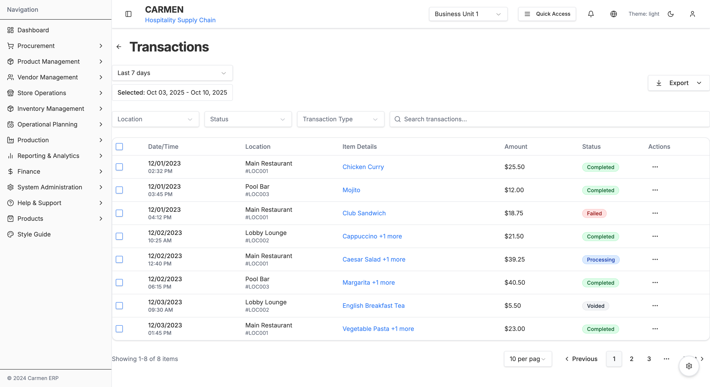
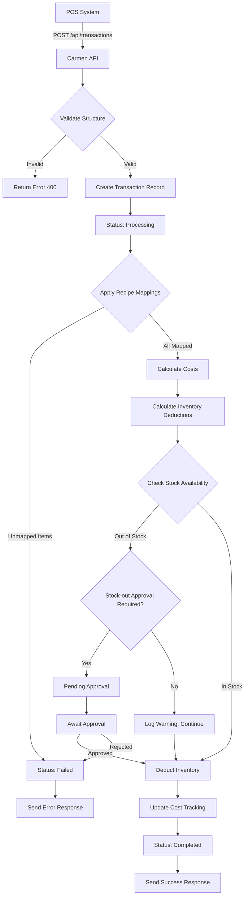

# POS Transactions Management

**Submodule**: Transactions
**Route**: `/system-administration/system-integrations/pos/transactions`
**Status**: ✅ Production
**Parent Module**: [POS Integration](./POS-INTEGRATION-MODULE.md)

## Overview

The Transactions module provides comprehensive management of POS sales transactions, including browsing, filtering, export, and transaction lifecycle operations. It enables full visibility into sales data synchronization and automated inventory adjustments.

## Screenshot


*Transaction Management - Browse, filter, and manage POS sales transactions with expandable item details*

## Key Features

### Transaction List Management
- ✅ Paginated transaction list (10/20/50/100 per page)
- ✅ Expandable item details per transaction
- ✅ Real-time status updates
- ✅ Bulk selection with checkboxes
- ✅ Row-level action menu
- ✅ Full transaction history with audit trail

### Advanced Filtering
- ✅ Date range picker with custom and preset ranges
- ✅ Location filter (multi-select with search)
- ✅ Status filter (Completed, Processing, Failed, Voided)
- ✅ Transaction type filter
- ✅ Full-text search across all fields
- ✅ Filter persistence across sessions

### Bulk Operations
- ✅ Select all transactions on current page
- ✅ Bulk export (PDF, Excel, CSV)
- ✅ Bulk void transactions
- ✅ Selected transaction counter
- ✅ Clear selection

### Export Capabilities
- ✅ Export selected transactions
- ✅ Export all transactions (filtered)
- ✅ Export current page
- ✅ Multiple formats: PDF, Excel, CSV
- ✅ Customizable export fields

## Page Structure

### Header Section
**Components**:
- Back button (returns to POS Dashboard)
- Page title: "Transactions"
- Date range picker
- Export dropdown button

### Filters Section
**Filter Controls**:
- **Location Filter**: Dropdown with search
  - Options: All Locations, Main Restaurant, Lobby Lounge, Pool Bar, etc.
  - Multi-select capability
- **Status Filter**: Dropdown
  - Options: All Status, Completed, Processing, Failed, Voided
- **Transaction Type Filter**: Dropdown
  - Options: Sales, Voids, Refunds, Manual Entries
- **Search Box**: Full-text search with icon
  - Searches: Transaction ID, Item names, Locations

### Selected Items Bar
**Appears when items are selected**:
- Text: "Selected: {count}"
- Action buttons:
  - View (opens detail modal)
  - Void (bulk void with confirmation)
  - Export (exports selected only)

### Transaction Table
**Columns**:
1. **Checkbox**: Select/deselect individual transaction
2. **Date/Time**:
   - Date (MM/DD/YYYY)
   - Time (HH:MM AM/PM)
3. **Location**:
   - Location name
   - Location code (gray text)
4. **Item Details**:
   - Primary item name
   - "+ X more" if multiple items (clickable to expand)
   - Expanded view shows all items with details
5. **Amount**: Total transaction amount ($X.XX)
6. **Status**: Badge with color coding
7. **Actions**: Dropdown menu icon

**Expandable Item Details**:
When expanded, shows table with:
- Item name
- Item code and category (gray text)
- Unit price × quantity
- Line total (bold)

### Pagination Section
**Components**:
- Records counter: "Showing 1-X of Y items"
- Rows per page selector: 10/20/50/100
- Page navigation:
  - First page button
  - Previous page button
  - Current page indicator: "Page X of Y"
  - Next page button
  - Last page button

## Data Structure

```typescript
interface Transaction {
  id: string                   // Unique transaction ID (TR-XXX)
  dateTime: Date               // Transaction timestamp
  location: {
    code: string              // Location code (LOC001)
    name: string              // Location name
  }
  items: TransactionItem[]     // Array of items in transaction
  amount: number               // Total transaction amount
  status: TransactionStatus    // Transaction status
  actions: string[]            // Available actions
  posTransactionId?: string    // Original POS transaction ID
  syncedAt?: Date             // When synced to Carmen
  processedAt?: Date          // When inventory updated
  voidedAt?: Date             // If voided, when
  voidedBy?: string           // User who voided
  errorMessage?: string       // If failed, error details
}

interface TransactionItem {
  code: string                 // Item code (ITEM001)
  name: string                // Item name
  category: string            // Menu category
  unitPrice: number           // Price per unit
  quantity: number            // Quantity sold
  recipeCode?: string         // Mapped recipe code
  costPerUnit?: number        // Recipe cost per unit
  totalCost?: number          // Total cost (quantity × cost)
}

type TransactionStatus =
  | 'completed'                // Successfully processed
  | 'processing'               // Currently being processed
  | 'failed'                   // Error occurred
  | 'voided'                   // Transaction cancelled
```

## Transaction Status Types

### Completed ✅
**Color**: Green badge
**Meaning**: Transaction successfully processed and inventory updated
**Available Actions**: View, Void, Export

**Processing Flow**:
1. POS system sends transaction data
2. Carmen validates transaction structure
3. Recipe mappings applied to all items
4. Inventory quantities calculated
5. Stock deducted from inventory
6. Cost tracking updated
7. Transaction marked as Completed
8. Timestamp recorded

### Processing 🔄
**Color**: Blue badge
**Meaning**: Transaction currently being processed (transient state)
**Available Actions**: View (limited)
**Typical Duration**: < 5 seconds

**Processing Steps**:
1. Receiving data from POS
2. Validating transaction
3. Applying mappings
4. Calculating costs
5. Updating inventory

### Failed ❌
**Color**: Red badge
**Meaning**: Error occurred during processing
**Available Actions**: View, Reprocess, Export

**Common Failure Reasons**:
- Unmapped POS item (no recipe mapping)
- Invalid quantity or price
- Insufficient inventory (if strict checking enabled)
- Recipe not found
- Location not mapped
- Data validation error
- Network timeout

**Resolution Process**:
1. Review error details
2. Fix underlying issue (e.g., create mapping)
3. Click "Reprocess" action
4. System retries transaction
5. Status updates to Completed or remains Failed

### Voided 🚫
**Color**: Gray badge
**Meaning**: Transaction cancelled, inventory adjustment reversed
**Available Actions**: View, Export (no void or reprocess)

**Void Process**:
1. User selects transaction(s)
2. Clicks "Void Transaction"
3. Confirmation dialog appears
4. User confirms void
5. System reverses inventory adjustments
6. Cost tracking updated
7. Transaction marked as Voided
8. Voided by user and timestamp recorded

**Business Rules**:
- Cannot void already voided transactions
- Cannot void processing transactions (wait for completion)
- Voiding reverses inventory deductions
- Voiding does NOT delete the transaction record
- Audit trail maintained for voided transactions

## User Workflows

### View Transaction History
1. Navigate to Transactions page
2. Transactions load with default filters (last 7 days, All Locations)
3. Scroll through list
4. Click on item details to expand
5. View all line items with pricing

### Filter Transactions
1. Click Date Range picker
2. Select preset (Today, Yesterday, Last 7 Days, Custom)
3. Or select custom date range
4. Select Location from dropdown
5. Select Status filter
6. Enter search text (optional)
7. Results filter automatically

### Export Transactions
1. Apply desired filters
2. Select transactions (optional, for selective export)
3. Click "Export" button
4. Choose export scope:
   - Export Selected (X) - if items selected
   - Export All - all transactions matching filters
   - Export Filtered - current filtered view
5. Select format (PDF/Excel/CSV)
6. File downloads automatically

### Void Transactions
1. Select transaction(s) using checkboxes
2. Click "Void" button
3. Confirmation dialog appears:
   - "Void X transactions?"
   - List of selected transactions
   - Warning about inventory reversal
4. Click "Confirm Void"
5. System processes void
6. Success message appears
7. Transactions update to Voided status

### Reprocess Failed Transaction
1. Filter by Status: Failed
2. Click on failed transaction to view details
3. Note error message
4. Fix underlying issue (e.g., create missing recipe mapping)
5. Click action menu → "Reprocess"
6. System retries transaction processing
7. Status updates:
   - Success → Completed
   - Still fails → Remains Failed with updated error

### Investigate High-Value Transaction
1. Search for transaction ID or filter by amount
2. Click to expand item details
3. Review all line items:
   - Item names and quantities
   - Unit prices and totals
   - Mapped recipes (if any)
4. Verify against POS receipt (if needed)
5. Take action if discrepancy found

## Transaction Processing Flow



## Integration Points

### Recipe Management
- Recipe lookup for cost calculation
- Recipe ingredient list for inventory deduction
- Recipe validation (active/inactive status)

### Inventory Management
- Real-time stock deduction
- Stock availability checking
- Location-specific inventory
- Stock-out alerting

### Reporting
- Transaction data for Gross Profit Analysis
- Transaction data for Consumption Report
- Daily sales summaries
- Performance metrics

### Notifications
- Failed transaction alerts
- Stock-out notifications
- High-variance alerts
- Bulk void confirmations

## Business Rules

### Transaction Processing Rules
1. All POS items must be mapped to recipes before processing
2. Transactions process in chronological order
3. Failed transactions do not affect inventory
4. Completed transactions can be voided (with reversal)
5. Processing transactions cannot be modified

### Voiding Rules
1. Only Completed transactions can be voided
2. Voiding reverses all inventory adjustments
3. Voiding requires user confirmation
4. Voided transactions remain in system (audit trail)
5. Cannot un-void a transaction (create new transaction instead)

### Export Rules
1. Maximum 10,000 transactions per export
2. Export includes only visible columns
3. Sensitive data (costs) included only for authorized users
4. Export filename includes date range and timestamp

### Search Rules
1. Search is case-insensitive
2. Searches transaction ID, item names, location names
3. Partial match supported (e.g., "chic" matches "Chicken Curry")
4. Search combines with other filters (AND logic)

## Performance Considerations

### Pagination
- Default page size: 10 transactions
- Large page sizes (100) may impact performance
- Recommendation: Use 20-50 for optimal balance

### Date Range
- Default: Last 7 days
- Wider date ranges increase load time
- Recommendation: Limit to 30 days for standard use

### Filtering
- Client-side filtering after data load
- All filters apply cumulatively (AND logic)
- Reset filters to improve performance

## Future Enhancements

1. **Real-time Updates**: WebSocket-based live transaction feed
2. **Transaction Details Modal**: Full detail view without page navigation
3. **Advanced Search**: Search by amount range, specific items, categories
4. **Batch Reprocessing**: Reprocess multiple failed transactions at once
5. **Transaction Annotations**: Add notes to transactions
6. **Customer Information**: Link transactions to customer profiles (if available from POS)
7. **Payment Method Tracking**: Track payment methods from POS data
8. **Split Transaction View**: View original vs adjusted amounts for voids
9. **Transaction Analytics**: Trends, patterns, anomaly detection
10. **Mobile App**: Mobile interface for transaction review on-the-go

## Related Documentation

- [POS Integration Module](./POS-INTEGRATION-MODULE.md)
- [Mapping Documentation](./MAPPING.md)
- [Reports Documentation](./REPORTS.md)
- [Inventory Management](../inventory/)

---

**Last Updated**: October 10, 2025
**Version**: 1.0
**Status**: Production
